## 目录

[TOC]

------

## 1.Go语言特点

- 没有"对象"，没有继承与多态，没有泛型，没有try/catch

- 有接口，函数式编程，CSP并发模型（goroutine+channel）

- 语法简单

  #### 课程预览流程图

  

  

## 2.基本语法

### 内建变量类型

#### 备注

> 前面部分内容在幕布里面

#### 强制转化

##### int类型必须要定义，不能隐式转化，而且float是不准的

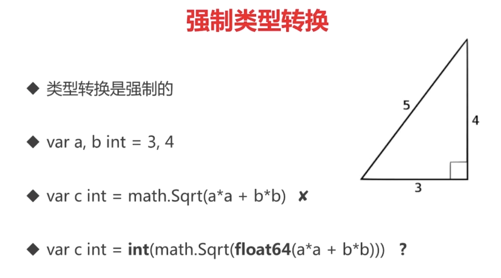

### 常量与枚举

#### 常量可以定义也可以不定义

#### 当然类型的定义也是可以批量的加'()'即可

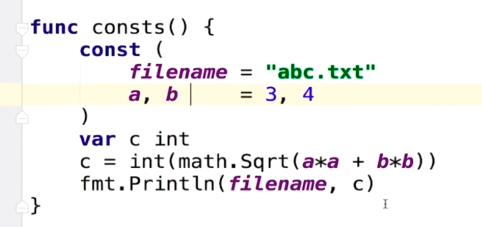

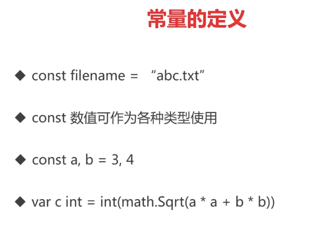

#### cpp=iota（iota代表的是之后的常量都是自增‘1,2,3...’）

#### 普通枚举类型

#### 自增值枚举类型

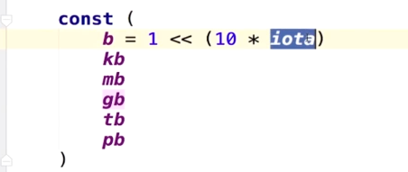

#### 变量要点定义回顾

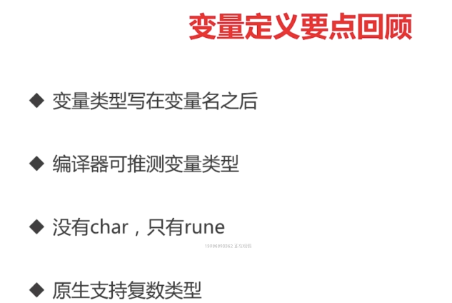

### 条件语句

#### if

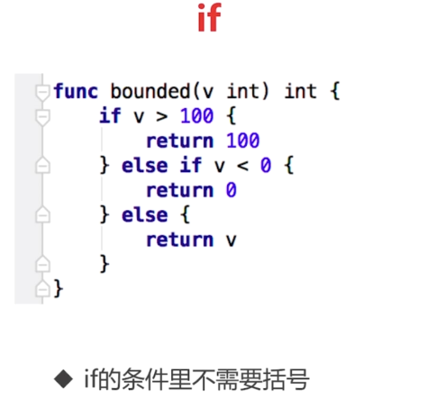

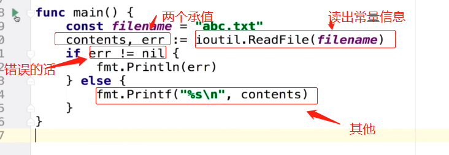

#### if的简写形式

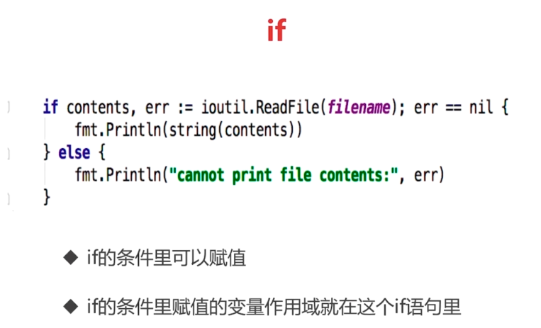

#### switch

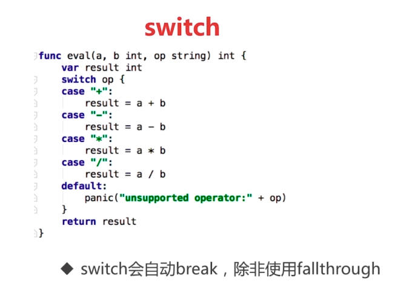

#### 实战switch

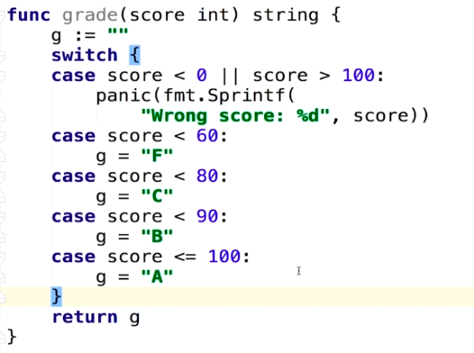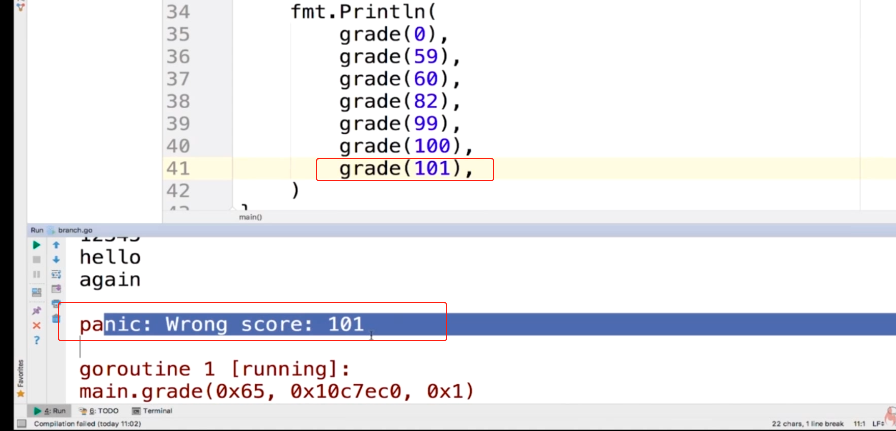

##### switch后面可以没有表达式

### 循环

#### for

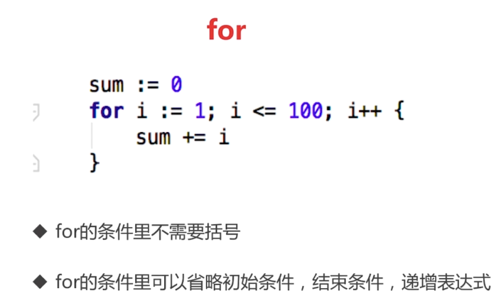

#### for实战（将整数转化为二进制）

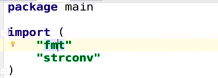

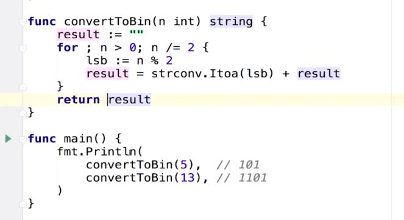

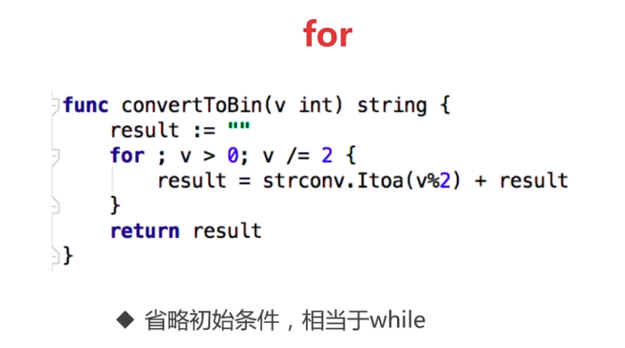

##### go语言的死循环

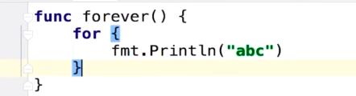

##### 初始，递增都可以省略（什么都省略就是死循环了）

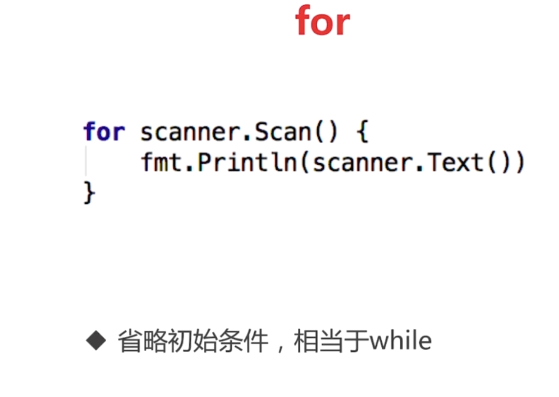

#### 基本语法要点回顾

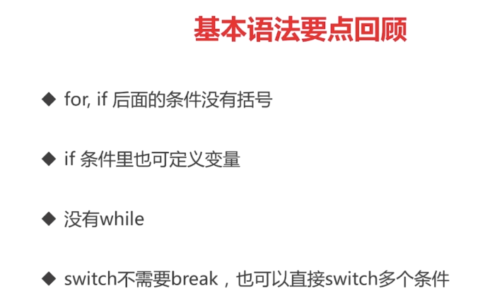

### 函数

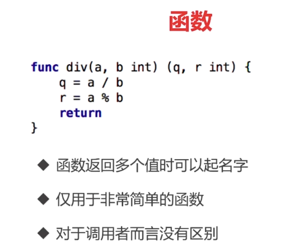

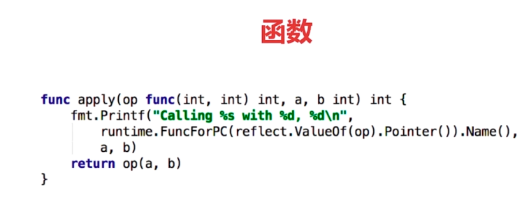

###### 这里是作为参数

#### 函数式编程的特点

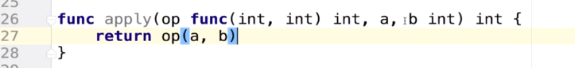


#### 可变参数列表

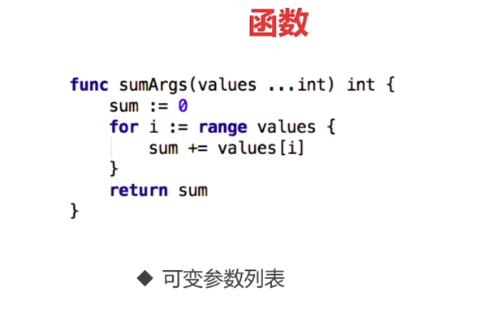

#### 要点回顾


### 指针

#### go语言的指针是不能运算的

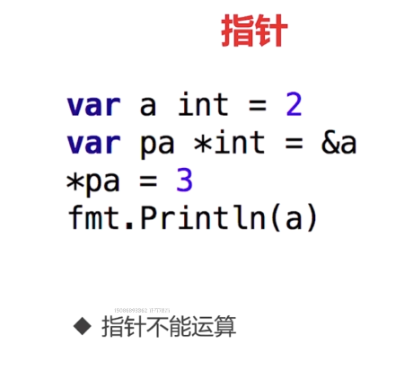

#### c++代码说明值传递，引用传递的区别

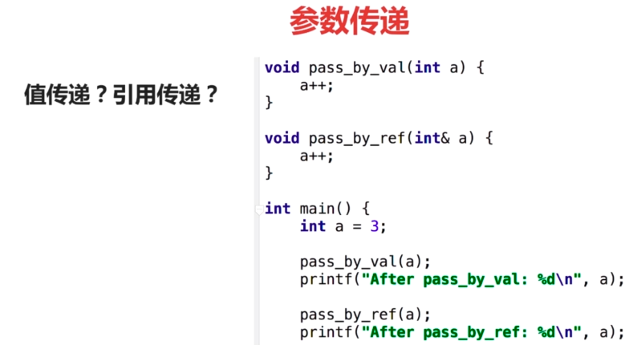

##### 正确答案最好是：3			4

##### Go语言只有值传递一种方式

#### 参数传递


##### 第二种传递方式


##### 第三种传递方式


## 3.内建容器

### 数组，切片与容器

### 数组

#### 数组写法的区别


#### range遍历的一些用法


#### 遍历注意点


#### 对range的说明


#### 数组是值类型

 

#### 切片


##### reslice的用法


##### slice的实现图


##### slice的扩展


##### 向slice添加元素


#### Map


##### Map的操作


##### Map的遍历


##### Map的key


#### 章节实列

##### 寻找最长不含有重复字符的子串

###### [leetcode链接](https://leetcode-cn.com/problems/longest-substring-without-repeating-characters/description/)


###### 解决方法


###### 代码部分


##### rune相当于go的char


##### 其他字串串操作

###### 通过strings.调出还有哪些字符串可以调用


## 4.面向对象

### 面向对象

#### 这里只有封装，并没有继承与多态

##### ——更多的是面向接口的开发


##### 残缺部分


##### 实列


#### 结构的创建


##### 结构创建像其他的如java都是在堆上的

###### 而在go语言里面不需要知道

##### 通过遍历建立树


##### 为结构定义方法

###### 其实就是其中的一种写法，语法糖


###### **值接收者**VS指针接收者

指针接收者


值接收者


#### 包和封装

##### 封装


##### 包


##### 包的扩展


##### GOPATH环境变量（环境变量的设置，哪怕是在hugo里面同样也需要设置）


###### 一般情况都是以这样的形式产生


##### go get获取第三方库


## 5.面向接口

### 接口

这里的Traversal也就是遍历的作用


#### duck typing

更多的是根据对象的功能性来进行研究的


##### python里面的duck typing


##### go语言重的接口


##### 接口的定义


##### 接口的实现

- 接口的实现是隐式的
- 只要实现接口里面的方法

##### 接口变量里面有什么

- 接口变量自带指针
- 接口变量同样采用值传递，几乎不需要使用接口的指针
- 指针接收者实现只能以指针方式使用，而值接收者都可以


##### 查看接口变量


###### 注意接口的组合


##### 常用系统接口

- 特殊接口：

  其实就是加一个对应的方法就行

  > stringer
  >
  > Reader/Writer

## 6.函数式编程

### 函数与闭包


#### 函数式编程VS函数指针


#### “正统”函数式编程


#### 闭包


##### python中的闭包


##### go语言闭包的应用


## 7.错误处理与资源管理

### 错误处理

#### defer的调用


#### 错误处理


##### 错误处理二

- 实现统一的错误处理逻辑

#### panic


#### recover


#### error VS panic


### 错误处理综合实列


## 8.测试与性能调优

### 测试


#### 传统测试 VS 表格驱动测试

##### 传统测试


##### 表格驱动测试


##### 测试运行执行代码

##### 使用pprof进行性能调优


###### 这样查看cpu.out文件


然后help直接可以对应交互的命令行

直接web，生成svg的文件，框越大优化的空间就越大


###### 上行上面的工具需要一个graphviz的，不然就生不出上面这张图

[Graphviz](http://www.graphviz.org/)

##### 测试


###### 上面就用了表格驱动测试

###### 代码覆盖


##### 性能测试


##### http测试


##### 写文档

## 9.Go语言的并发编程

### goroutine


#### 协程coroutine


##### 检测数据冲突

```shell
go run goroutine.go
```

```shell
go run -race goroutine.go
```

##### 子程序协程是一个特例


##### 协程与普通函数的对比


##### 其他语言的协程

###### C++与java中


###### python中协程


##### go语言重的goroutine线程解析图


##### goroutine的定义


###### 使用-race来检测数据访问冲突

##### goroutine可能切换的点


用top可以查看CPU等的占有率

## 10.通道channel