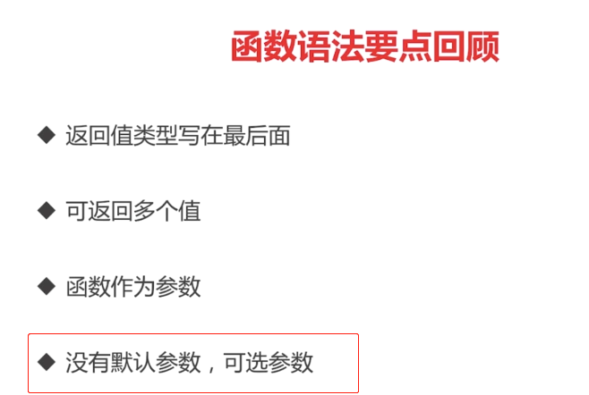

## 目录

[TOC]

------

## 2.基本语法

### 内建变量类型

#### 备注

> 前面部分内容在幕布里面

#### 强制转化

##### int类型必须要定义，不能隐式转化，而且float是不准的

### 常量与枚举

#### 常量可以定义也可以不定义

#### 当然类型的定义也是可以批量的加'()'即可

#### cpp=iota（iota代表的是之后的常量都是自增‘1,2,3...’）

#### 普通枚举类型

#### 自增值枚举类型

#### 变量要点定义回顾

### 条件语句

#### if

#### if的简写形式

#### switch

#### 实战switch

##### switch后面可以没有表达式

### 循环

#### for

#### for实战（将整数转化为二进制）

##### go语言的死循环

##### 初始，递增都可以省略（什么都省略就是死循环了）

#### 基本语法要点回顾

### 函数

###### 这里是作为参数

#### 函数式编程的特点

#### 可变参数列表

#### 要点回顾

### 指针

#### go语言的指针是不能运算的

#### c++代码说明值传递，引用传递的区别

##### 正确答案最好是：3			4

##### Go语言只有值传递一种方式

#### 参数传递

##### 第二种传递方式

##### 第三种传递方式

## 3.内建容器

### 数组，切片与容器

### 数组

#### 数组写法的区别

#### range遍历的一些用法

#### 遍历注意点

#### 对range的说明

#### 数组是值类型

 

#### 切片

##### reslice的用法

##### slice的实现图

##### slice的扩展

##### 向slice添加元素

#### Map

##### Map的操作

##### Map的遍历

##### Map的key

#### 章节实列

##### 寻找最长不含有重复字符的子串

###### [leetcode链接](https://leetcode-cn.com/problems/longest-substring-without-repeating-characters/description/)

###### 解决方法

###### 代码部分

##### rune相当于go的char

##### 其他字串串操作

###### 通过strings.调出还有哪些字符串可以调用

## 4.面向对象

### 面向对象

#### 这里只有封装，并没有继承与多态

##### ——更多的是面向接口的开发

##### 残缺部分

##### 实列

#### 结构的创建

##### 结构创建像其他的如java都是在堆上的

###### 而在go语言里面不需要知道

##### 通过遍历建立树

##### 为结构定义方法

###### 其实就是其中的一种写法，语法糖

###### **值接收者**VS指针接收者

指针接收者

值接收者

